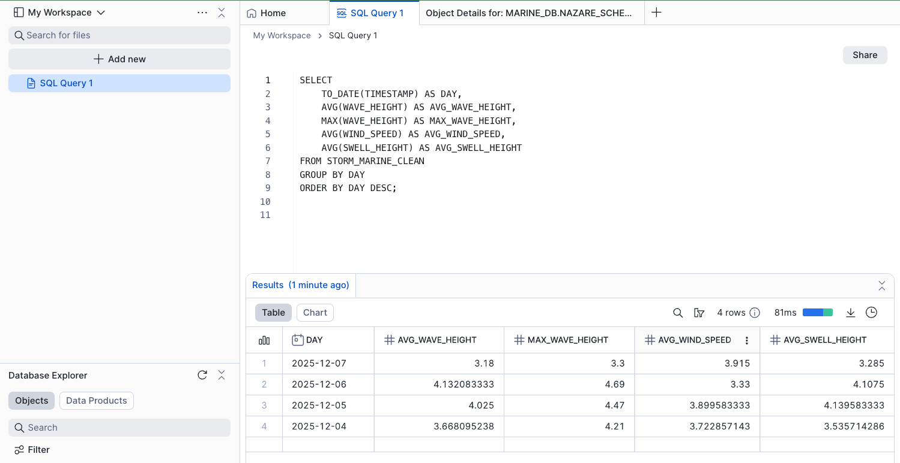

# 🌊 Nazaré Marine Analytics Dashboard
**Real-time Marine Data • Snowflake • StormGlass API • Streamlit • Forecasting**

This project implements a full big data pipeline using:

**StormGlass Marine Weather API**

**Snowflake (Snowpark + SQL + Streamlit)**

**Python ingestion scripts**

**Machine learning forecasting**

The system monitors real-time marine conditions at**Nazaré, Portugal**, one of the most dangerous big-wave zones on the planet.

## 📍 Coordinates Monitored:

**Latitude: 39.60475**

**Longitude: -9.085443**

Nazaré's waves—reaching 20–30 meters—pose significant risks to surfers, fishermen, and rescue teams.
This dashboard provides live monitoring, pattern insights, hazard detection, and 24-hour forecasting.

# ⚙️ Setup Instructions

## 1️⃣ Clone the repo
git clone <repo-url>
cd <repo-folder>

## 2️⃣ Create .env

STORMGLASS_API_KEY=your_api_key
SNOW_ACCOUNT=xxxxxx-xx
SNOW_USER=username
SNOW_PASSWORD=password
SNOW_ROLE=SYSADMIN
SNOW_WAREHOUSE=COMPUTE_WH
SNOW_DATABASE=MARINE_DB
SNOW_SCHEMA=NAZARE_SCHEMA

## 3️⃣ Install dependencies
pip install -r requirements.txt

## 4️⃣ Run the ingestion job
python ingest_marine.py

## 5️⃣ Run dashboard locally
streamlit run nazare-wave-dashboard.py

## 🔍 Notebook Analysis 

This notebook uses Snowpark to:

**✔ Load table from Snowflake**

Inspect schema

Validate datatypes

Count rows and timestamp range

**✔ Explore dataset (EDA)**

Wave height distributions

Time-series patterns across days

Correlations (wind ↔ wave, swell ↔ wave)

Daily summaries

**✔ Prepare ML-ready series**

Hourly resampling

Missing value interpolation

Normalized time index

## 🧪 SQL Analytical Queries

**Query #1 — Daily Wave Summary**

SELECT
    TO_DATE(TIMESTAMP) AS DAY,
    AVG(WAVE_HEIGHT) AS AVG_WAVE_HEIGHT,
    MAX(WAVE_HEIGHT) AS MAX_WAVE_HEIGHT,
    AVG(WIND_SPEED) AS AVG_WIND_SPEED,
    AVG(SWELL_HEIGHT) AS AVG_SWELL_HEIGHT
FROM STORM_MARINE_CLEAN
GROUP BY DAY
ORDER BY DAY DESC;

(screenshots/SQL_Query_1.png)

**Query #2 — Dangerous Wave Detection**

SELECT
    COUNT(*) AS DANGEROUS_WAVE_COUNT,
    MIN(WAVE_HEIGHT) AS MIN_DANGER,
    MAX(WAVE_HEIGHT) AS MAX_DANGER,
    AVG(WAVE_HEIGHT) AS AVG_DANGER,
    TO_DATE(TIMESTAMP) AS DAY
FROM STORM_MARINE_CLEAN
WHERE WAVE_HEIGHT > 6.0
GROUP BY DAY
ORDER BY DAY DESC;

(screenshots/SQL_Query_2.png)

## Query 3 — Correlation Analysis

SELECT
    CORR(WAVE_HEIGHT, WIND_SPEED) AS CORR_WAVE_WIND,
    CORR(WAVE_HEIGHT, SWELL_HEIGHT) AS CORR_WAVE_SWELL
FROM STORM_MARINE_CLEAN;

(screenshots/SQL_Query_3.png)

## 📊 Dashboard Features (Streamlit in Snowflake)

**Date Selector**
**Time Selector**
**Danger Threshold Slider**
**Summary KPIs**
**Interactive Wave Map**
**Wave Height Gauge Meter**
**Time-Series Charts**
**Scatter Insights**
**Hourly Pattern Chart**
**24-Hour Forecast Model (Machine Learning)**

🤖 Machine Learning Forecasting Component

Uses NumPy linear regression (polyfit) to forecast wave height for the next 24 hours.

Model components:

Input: last 3 days of hourly wave heights

Output: predicted next 24 hours

Confidence Interval: 95%

Display: Combined history + forecast chart

## 📍 Dashboard Overview

## 🌊 Wave Map & Gauge Meter

![Wave Map] (screenshots/Wave%20Map.png)
![Gauge Meter] (screenshots/Gauge%20Meter.png)

## 📈 Forecast Chart

## 📉 Time Series

## 🧪 SQL + Notebook Insights

![Notebook Insights]

(screenshots/newplot.png) 
(screenshots/Distribution_of_wave_height.png)
(screenshots/windspeedvswaveheight.png)
(screenshots/dailyavgandmaxwavaeheight.png)

## 🌊 Why Nazaré Matters

Nazaré's waves are amplified by the deep Nazaré Canyon, creating sudden, extreme wave heights that threaten:

Surfers

Coastal safety teams

Fishermen

Tourists

Your dashboard helps:

Detect dangerous waves

Understand environmental patterns

Forecast upcoming risks

Support early warning and rescue decisions

Real-time analytics in locations like Nazaré can save lives.

🙏 Acknowledgments

StormGlass.io (Marine Weather API)

Snowflake (Streamlit + Snowpark)

